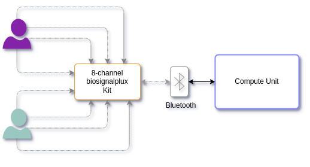

# [biosignalplux-ros](#biosignalplux-ros)

<p>
 <div align="center">
 <a href="https://www.hs-kempten.de/ifm" target="_blank">
      </a>
  </p>
  <div>
    
    
    
  
    
    
    
    
  </div>
  </br>
</div>

This tool was developed in the context of the public-funded [HERMES-Project](https://www.hs-kempten.de/forschung/forschungsinstitute/ifm-institut-fuer-fahrerassistenz-und-vernetzte-mobilitaet/hermes). It is funded by the Bavarian Ministry of Economics Affairs, Regional Development and Energy. Grant number DIK0352/01

## [Overview](#overview)

This ROS package interfaces with a biosignalplux device ([8-channel biosignalplux Kit](https://www.pluxbiosignals.com/products/8-channel-biosignals-kit)), capturing data through the Bluetooth connection using a provided MAC address. The data is read from the device, processed, and then published to a ROS topic as a custom message, `biosignalplux::biosignal`, which includes analog signal data from all 8 channels. This package is designed to collect the data of up to two subjects on a raw-data level.

<div align="center">
 <a href="https://www.hs-kempten.de/ifm" target="_blank">
      </a>
  </p>
</div>
  
Thanks to the C++-based APIs provided by [pluxbiosignals](https://github.com/pluxbiosignals/cpp-samples), multiple architectures are supported. We run the presented package on

- ARM32
- ARM64
- x86_64

We used a Raspberry Pi 4, a [NVIDIA ORIN AGX Development Kit 64 Gb](https://www.nvidia.com/de-de/autonomous-machines/embedded-systems/jetson-orin/) (Jetpack Version 5.1.1), and multiple x86-64 devices for data acquisition. All devices running Linux Ubuntu.

# [Table of contents](#table-of-contents)

- [biosignalplux-ros](#biosignalplux-ros)
- [Table of contents](#table-of-contents)
- [Features](#features)
- [Dependencies](#dependencies)
- [Usage](#usage)
- [Data conversion](#data-conversion)

  - [Class Overview](#class-overview)
  - [Methods](#methods)

- [License](#license)

---

## [Features](#features)

**Bluetooth Interface**: Connects to the biosignal device using its MAC address.

**Data Acquisition**: Captures analog biosignal data from up to 8 channels at a specified sampling frequency. Defaults to 500 Hz for sufficient acquisition.

**ROS Integration**: Publishes the acquired biosignal data to a ROS topic for further processing or analysis.

## [Dependencies](#dependencies)

This package depends on several ROS standard message packages and custom headers for device interaction:

- roscpp
- std_msgs
- biosignalplux (custom message type for biosignal data)

## [Usage](#usage)

### Launching the Node

Before running the node, make sure to set the necessary parameters in the launch file:

**mac_address**: The MAC address of the biosignal device.

**frequency**: The sampling frequency of the device.

Launch the node using the following command:

`roslaunch biosignalplux biosignalplux.launch`

**Parameters**

- mac_address (string): The Bluetooth MAC address of the biosignal device.
- frequency (int): The sampling frequency (in Hz) for acquiring data from the device.

### Published Topics

biosignalplux (biosignalplux::biosignal): Publishes the biosignal data, including:

- standard header (including time information)
- analog_1 to analog_8: Analog signals from the device's channels.
- sequence: Sequence number of the frame, useful for synchronizing data.

### Custom Message Definition

The custom message biosignalplux::biosignal is defined as follows:

```
Header header
int64 sequence
float32 analog_1
float32 analog_2
float32 analog_3
float32 analog_4
float32 analog_5
float32 analog_6
float32 analog_7
float32 analog_8
```

## [Data conversion](#data-conversion)

For converting the measured raw data, we provide transfer functions for every signal captured in `./scripts/pyhsio_math.py`.

`BioSignalPluxDevice` is a Python class designed to interface with a biosignal acquisition device. The class provides transfer functions for different biosignals such as Electrodermal Activity (EDA), Electroencephalography (EEG), Electromyography (EMG), and Electrocardiography (ECG). These transfer functions convert raw values from the device into meaningful units like Microsiemens, Microvolts, or Millivolts.

### [Class Overview](#class-overview)

- **Parameters:**

  - `nADC` (int, optional): Resolution of the Analog-to-Digital Converter (ADC). Defaults to 16.
  - `VCC` (int, optional): Operating voltage in volts. Defaults to 3.

- **Attributes:**
  - `nADC`: Stores the resolution of the ADC.
  - `vcc`: Stores the operating voltage.
  - `nFac`: Precomputed factor, calculated as \(2^{nADC}\).

### [Methods](#methods)

The following methods are used to determine physical signals from the raw data.

1. Transfer function for the Electrodermal Activity (EDA) signal.
   - `tf_EDA(self, x, clip=False)`
2. Transfer function for the Electroencephalography (EEG) signal.
   - `tf_EEG(self, x, clip=False)`
3. Transfer function for the Electromyography (EMG) signal.
   - `tf_EMG(self, x, clip=False)`
4. Transfer function for the Electrocardiography (ECG) signal.
   - `tf_ECG(self, x, clip=False)`

# [License](#license)

MIT License

Copyright (c) 2024 IFM.adrive

Permission is hereby granted, free of charge, to any person obtaining a copy of this software and associated documentation files (the "Software"), to deal in the Software without restriction, including without limitation the rights to use, copy, modify, merge, publish, distribute, sublicense, and/or sell copies of the Software, and to permit persons to whom the Software is furnished to do so, subject to the following conditions:

The above copyright notice and this permission notice shall be included in all copies or substantial portions of the Software.

THE SOFTWARE IS PROVIDED "AS IS", WITHOUT WARRANTY OF ANY KIND, EXPRESS OR IMPLIED, INCLUDING BUT NOT LIMITED TO THE WARRANTIES OF MERCHANTABILITY,FITNESS FOR A PARTICULAR PURPOSE AND NONINFRINGEMENT. IN NO EVENT SHALL THE
AUTHORS OR COPYRIGHT HOLDERS BE LIABLE FOR ANY CLAIM, DAMAGES OR OTHER LIABILITY, WHETHER IN AN ACTION OF CONTRACT, TORT OR OTHERWISE, ARISING FROM, OUT OF OR IN CONNECTION WITH THE SOFTWARE OR THE USE OR OTHER DEALINGS IN THE
SOFTWARE.

<p align=center>
</p>
